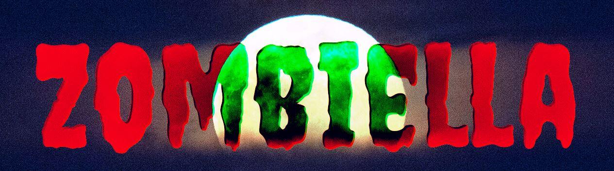
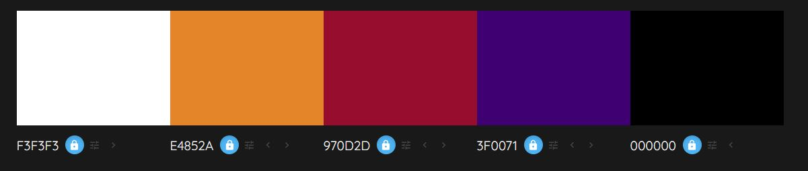
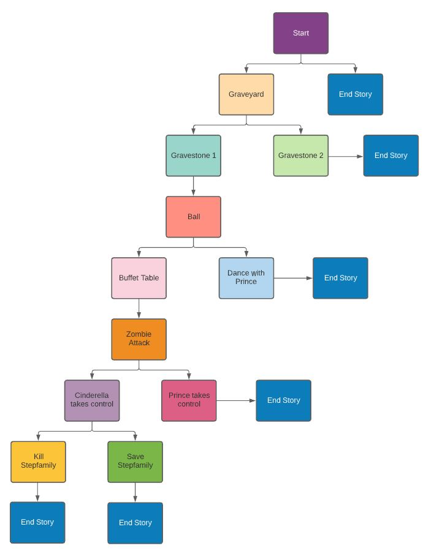
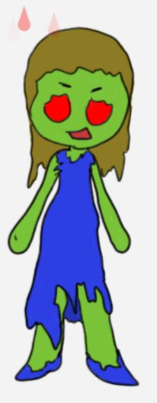
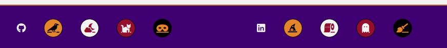

# ZOMBIELLA
A story of love, confidence and Zombies!

If you are brave enough to visit the live story, follow this [link](https://andrewdempsey2018.github.io/Zombiella/ "Zombiella")

&nbsp;

# Goal for this Project
This project is a Halloween themed story, loosely based on the fairy tale of Cinderella with the added extras of zombies and porridge! Navigate your way through the chilling tale and decide your fate.

&nbsp;

# Table of Contents
* [UX](#ux "UX")
    * [User Goals](#user-goals "User Goals")
    * [User Stories](#user-stories "User Stories")
    * [User Requirements and Expectations](#user-requirements-and-expectations)
         * [Requirements](#requirements)
         * [Expectations](#expectations)
    * [Site Owners Goals](#site-owners-goals)
    * [Strategy](#strategy)
        * [Strategy Outline](#strategy-outline)
        * [Strategy Description](#strategy-description)
    * [Wireframes](#wireframes)
    * [Design Choices](#design-choices)
        * [Fonts](#fonts)
        * [Colours](#colours)
        * [Images](#images)
        * [Structure](#structure)
    * [Features](#features)
        * [Existing Features](#existing-features)
        * [Features to be implemented](#features-to-be-implemented)
    * [Technologies used](#technologies-used)
        * [Languages](#languages)
        * [Libraries and Frameworks](#libraries-and-frameworks)
        * [Tools](#tools)
    * [Testing](#testing)
        * [UX Testing](#ux-testing)
        * [Code Validation](#code-validation)
        * [Bugs](#bugs)
        * [Unfixed Bugs](#unfixed-bugs)
    * [Deployment](#deployment)
        * [Clone the Repo](#clone-the-repo-with-gitpod)
    * [Dev-Log](#dev-log)
    * [Credits](#credits)
# UX

## User Goals
* An entertaining story that keeps interested running
* A familiar story, but with unusual twist and endings
* An obvious Halloween theme

## User Stories
* As a user, I want to navigate through the story efficiently
* As a user, I want to have different options to proceed through the story
* As a user, I want to have appropriate animations visible
* As a user, I want to have clear instructions on when to interact
* As a user, I want to know when the story has finished
* As a user, I want to be able to restart the story

## User Requirements and Expectations
### Requirements
* Clear instruction when an interaction is required
* Clear instruction on how to interact
* Animations that are relevant
* Screen displays to be different for each part of the story
* Visual prompt to know when an option has been selected
* Ability to reread the story after completion
* Quality content that relates to the original story
* No long paragraphs, text to be created in short sections

### Expectations
* I expect to know the title of the story
* I expect to know when to interact with the story
* I expect to know when the story is over
* I expect to be entertained
* I expect to have clear definition between parts of the story

## Site owners Goals
* Single page layout with clear text displayed
* Depict a Halloween story with a dramatic twist
* Ensure the story can be interacted with in some way
* Include animated elements

## Strategy
### Strategy Outline
The items are graded in a 0 - 5 system in both importance and feasibility as per the grading system below.

&nbsp;

| | Score - 0 | Score - 3 | Score - 5 |
|--|--|--| -- |
| Importance | Unwise use of time to address | Efforts should be made to accommodate these | Efforts MUST be made to address these
| Feasibility | Unwise use of time to address| Efforts should be made to accommodate these | Efforts MUST be made to address these

&nbsp;

The outcome is calculated by combining the scores from the *Importance* and *Feasibility* ratings. This then gives a final strategy rating of what items and where to focus on.

| | Score - 0 | Score - 5 | Score - 10 |
|--|--|--| -- |
| Item Description | Not viable | Efforts should be made | Efforts MUST be made

&nbsp;

### Strategy Description
|Item Description | Importance Score | Feasibility Score | Outcome |
| --------------- | ----------| -----------| ----------|
| Ensure the story can be interacted with in some way |5 | 5 |10 |
| Include appropriate animated elements |5 | 5 |10 |
| Ability to restart the story | 4 | 5 |8 |
| Clear instructions on when to interact |5 | 5 |10 |
| Obvious Halloween theme |5 | 5 |10 |
| Displayed on a single screen | 2 | 5 | 7 |

\
&nbsp;
[Back to Top](#table-of-contents)
\
&nbsp;

# Wireframes
To develop the wireframes, we have used [Balsamiq](https://balsamiq.com/wireframes/)

The wire frames can be viewed below.

[Mobile Wireframe](readme-images/wireframes/mobile-wireframe.jpg)

[Tablet Wireframe](readme-images/wireframes/tablet-wireframe.jpg)

[Desktop Wireframe Screen 1](readme-images/wireframes/desktop-wireframe.jpg)

[Desktop Wireframe Screen 2](readme-images/wireframes/desktop-wireframe-1.jpg)

\
&nbsp;
[Back to Top](#table-of-contents)
\
&nbsp;

## Design Choices
### Fonts
We have used [Google Fonts](https://fonts.google.com/ "Google Fonts") to select suitable fonts for the story. In 2011, google released a Haloween range of fonts and we have decided to go for [Creepster](https://fonts.google.com/specimen/Creepster?query=cree&preview.text=Zombiella&preview.text_type=custom#standard-styles "Creepster") for the headings and logo. For the main text within the story, we decided with [Arvo 400](https://fonts.google.com/specimen/Arvo?query=arvo&preview.text=Once%20upon%20a%20time......&preview.text_type=custom "Arvo") as it compliments Creepster and gives an old storybook look to the text.

### Colours
Initially, we began looking for a colour pallet using [colorhunt](https://colorhunt.co/palettes/halloween "colorhunt") and searched using Halloween as a key work. From this, we converted the key colours into [Colourmind](http://colormind.io/ "Colourmind"), then completed the rest of the pallet. 

These colours give great flexibility as there is the possibility of several combinations of text and background colour that pass the [WebAIM](https://webaim.org/resources/contrastchecker/ "WebAIM") tests. The results can be seen below.

* White text with black background - [link](readme-images/colour-pallet/colour-pallet-white-black.jpg "Link")
* White text with purple background - [link](readme-images/colour-pallet/colour-pallet-white-purple.jpg "Link")
* White text with red background - [link](readme-images/colour-pallet/colour-pallet-white-red.jpg "Link")
* Orange text with black background - [link](readme-images/colour-pallet/colour-pallet-orange-black.jpg "Link")

### Images

### Breakpoints
Our breakpoints will be based on the [Bootstrap breakpoints](https://getbootstrap.com/docs/5.0/layout/breakpoints/ "Bootstrap"). We may not necessarily be requiring all of these, but if breakpoints are needed, they will be at these points.

| Screen Size | Breakpoint |
| ----------- | ---------- |
| x-small     | <576px     |
| small       | => 576px   |
| medium      | => 768px   |
| large       | => 992px   |
| x-large     | => 1200px  |

### Structure
The structure of this project has been mapped out using [Lucid](https://lucid.co/ "Lucid").

Creating the flow, allowed us to create a basic outline of the story in order to develop the content.

&nbsp;

\
&nbsp;
[Back to Top](#table-of-contents)
\
&nbsp;

# Features

## Existing Features

* **Header**: shows the title of the story and when clicked the page reloads, this allows the user to start the story again.

&nbsp;

* **Navigation bar**: it allows the user to navigate through the story by providing the correct buttons to carry on with the story. It is composed by a "next" button, "read again" button, and two buttons that allow the user to make a choice when required.

&nbsp;

* **Scene area**: area where the user can see the animation of the story.

 

&nbsp;

* **Footer**: it contains the link to the Github and LinkedIn profiles of all the developers that worked on the project.

&nbsp;

## Features to be Implemented

* Implement more paths the user can go through when having to choose what Cinderella's options, so the reading experience is completely different everytime you read it.

* Implement more interaction with the graphics, so the user will be able to click on an element and this would be animated.

* The users can enter their name when starting the story so it is more personalised and they get more involved in it.

* Creating an application using [Kaboom](https://kaboomjs.com/)

\
&nbsp;
[Back to Top](#table-of-contents)
\
&nbsp;

# Technologies used

## Languages
* [HTML](https://en.wikipedia.org/wiki/HTML5 "HTML") for the structure of the story
* [CSS](https://en.wikipedia.org/wiki/CSS "CSS") for the design of the story
* [JavaScript](https://en.wikipedia.org/wiki/JavaScript "JS") for the interactive elements of the story
* [Markdown](https://en.wikipedia.org/wiki/Markdown) for the content in my README file

## Libraries and Frameworks

## Tools
* For creating the story flow [Lucid](https://lucid.co/ "Lucid")
* For spell checking [Grammarly](https://chrome.google.com/webstore/detail/grammarly-for-chrome/kbfnbcaeplbcioakkpcpgfkobkghlhen/related?hl=en "Grammarly")
* For the wireframes [Balsamiq](https://balsamiq.com/wireframes/)
* For initial colour pallet ideas [colorhunt](https://colorhunt.co/palettes/halloween "colorhunt")
* For final colour pallet [Colourmind](http://colormind.io/ "Colourmind")
* For the fonts [Google Fonts](https://fonts.google.com/ "Google Fonts")
* For colour contrast checking [WebAIM](https://webaim.org/resources/contrastchecker/ "WebAIM")
* For the blood drips [Adib Behjat](https://codepen.io/abehjat/pen/oXMENv "Adib Behjat")

# Testing

Our testing group consisted of a couple of age groups and varied abilities involving tech. We asked them to simply navigate through the story and find their own ending.

&nbsp;

| Age | Tech Experience | Task Completed | Comments/ Improvements
| --- | ----------      | -------------  | --------
| 7 | Basic | Yes | Cool story
| 6 | Basic | Yes | Better than my book
| 6 | Basic | Yes | I like the zombies
| 42 | Moderate | Yes | Well done, it looks great

&nbsp;

### UX Testing

| Requirements & Expectations | Implemented | Tested | Comments
| ------------ | ----------- | ------ | --------
| Know the title of the story | Yes | Yes | Clear and obvious at the top of the screen
| Clear definition between parts of the story | Yes| Yes | The text on the screen changes to indicate this
| Animations that are relevant | Yes | Yes | Blood drops and the artwork
| Screen displays to be different for each part of the story | Yes | Yes | Artwork changes with the story
| Ability to reread the story after completion | Yes | Yes | Buttons prompt to read again

&nbsp;

&nbsp;

| User Goals | Implemented | Tested | Comments
| ------------ | ----------- | ------ | --------
| An entertaining story that keeps interested running | Yes | Yes | Completed
| A familiar story, but with unusual twists and endings | Yes | Yes | Completed
| An obvious Halloween them | Yes | Yes | Completed

&nbsp;

&nbsp;

| Site Owners Goals | Implemented | Tested | Comments
| ------------ | ----------- | ------ | --------
| Single page layout with clear text displayed | Yes | Yes | Completed
| Depict a Halloween story with a dramatic twist | Yes | Yes | Completed
| Ensure the story can be interacted with in some way | Yes | Yes | Completed
| Include animated elements | Yes | Yes | Completed

\
&nbsp;
[Back to Top](#table-of-contents)
\
&nbsp;

## Code Validation

Our code has been validated using:

* HTML - [W3C HTML Validation Service](https://validator.w3.org/ "W3C HTML")
* CSS - [W3C CSS Validation Service](https://jigsaw.w3.org/css-validator/ "W3C CSS")
* JavaScript - [Esprima](https://esprima.org/demo/validate.html "Esprima")

\
&nbsp; 

## Bugs
We had an issue where one of our team members had a problem with VSCode. Something *spooky* happened and it managed to merge an old version with a new one leaving us with a complete mess. With such a solid and experienced team, one call and 5 minutes later we were able to fix this and get back on track.

Whilst working on the Javascript element of the scripting engine, there was a recurring error happening that was hard to track down. We managed to output the contents of the error to the console and it was returning the text "Sleepy[v=puAV]Sneezy[Wtq6_GM]" LOL. In the end we discovered that the error was happening because of improperly closed curly braces.

## Unfixed Bugs

There are no unfixed bugs.

\
&nbsp;
[Back to Top](#table-of-contents)
\
&nbsp;

# Deployment

The live link for this project can be viewed [here](https://andrewdempsey2018.github.io/Zombiella/ "Zombiella")
 
### Clone the repo with GitPod
* Log in to your GitHub account
* Follow this link to access this repository - [*ZOMBIELLA*](https://github.com/andrewdempsey2018/Zombiella "Zombiella")
* Select the **Code** dropdown button situated above the list of files
* Make sure that the HTTPS tab is selected
* Click on the **Copy** button to the right of the URL
* Open a new GitPod workspace
* In the terminal type *git clone (paste the URL here)* and then press enter
* The repo will now be downloaded and cloned
* Open your [GitPod workspaces](https://gitpod.io/workspaces "GitPod workspaces")
* Select the three dots to the right-hand side of your workspace and select **Pin**

\
&nbsp;
[Back to Top](#table-of-contents)
\
&nbsp;

# Dev-Log

## Andrew Dempsey

This Hackathon was a very enjoyable experience. I had the opportunity to work with a team of super talented and motivated coders. The 'Spookatooners' worked great together by keeping each other motivated, lending a helping hand when needed & giving feedback as well as suggestions on each other's work. We all learned a great deal about working together as a team, planning and managing tasks within a large project as well as learning valuable new technical skills. The best parts of the experience were producing an excellent end product, making new friends and of course, having fun!

## Ana Genover

I have highly enjoyed participating in this hackaton. It is fantastic to have had the opportunity to work on a project with other students, learn together, be supportive to each other and, most importantly have fun. Overall it is been a great experience, this is my first hackaton and I will surely register for the next one.

## Sean Young

## Sam Timmins

For my first hackathon, I joined apprehensive of what was involved. With a quality team of coders, my jitters were soon put to rest. We ended up being a very balanced team, each having a talent in different aspects of the project to bring together a great final result. I went in with very little Github experience, and thanks to the patience of the team, I feel much more comfortable with it. Working in a team to create a project, has made me approach the process differently and I will be using this experience to add to my creations.

# Credits

We would like to thank our AMAZING facilitator Stefan for his advice and guidance

Some artwork based on reference material by [okojochan](https://www.patreon.com/okojochan)

\
&nbsp;
[Back to Top](#table-of-contents)
\
&nbsp;
